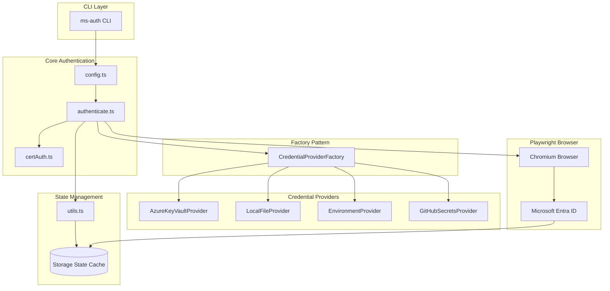
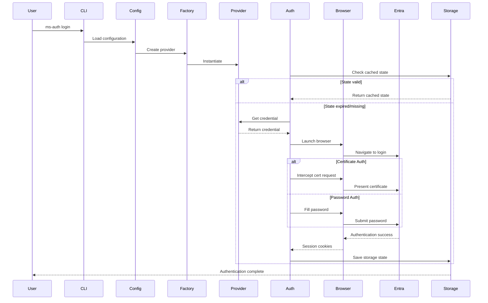
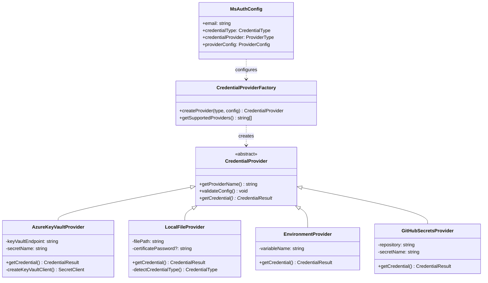
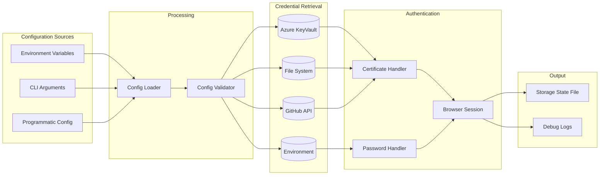
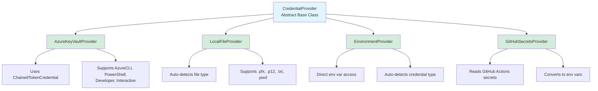

# Playwright Microsoft Authentication

[](https://github.com/deepakkamboj/playwright-ms-auth/actions/workflows/ci.yml)
[](https://www.npmjs.com/package/playwright-ms-auth)
[](https://opensource.org/licenses/MIT)
[](https://nodejs.org/)

[](https://www.typescriptlang.org/)
[](https://playwright.dev/)
[](https://azure.microsoft.com/)

> Enterprise-grade authentication solution for Playwright E2E tests with Microsoft Entra ID (formerly Azure AD)

A robust, production-ready authentication framework that simplifies Microsoft identity integration in Playwright test suites. Built with the Abstract Factory pattern, it supports both password and certificate-based authentication across multiple credential providers including Azure KeyVault, local files, environment variables, and GitHub Secrets.

Perfect for enterprise test automation requiring secure, reusable authentication flows with multi-region support and smart session caching. Get started in seconds with just email and password, or use enterprise-grade providers like Azure KeyVault for production.

## Tech Stack

### Core Dependencies

- **[Playwright](https://playwright.dev/)** (v1.44.1) - Browser automation framework
- **[TypeScript](https://www.typescriptlang.org/)** (v5.4.4) - Type-safe development
- **[Commander.js](https://github.com/tj/commander.js)** (v11.0.0) - CLI framework
- **[@azure/keyvault-secrets](https://www.npmjs.com/package/@azure/keyvault-secrets)** (v4.8.0) - Azure KeyVault integration
- **[@azure/identity](https://www.npmjs.com/package/@azure/identity)** (v4.2.1) - Azure authentication

### Runtime Requirements

- **Node.js** ≥18
- **Playwright Chromium** browser

### Build & Development

- **TypeScript Compiler** - ES2020 target, ESM modules
- **Rimraf** - Cross-platform file cleanup

## Features

- 🔐 **Multiple Authentication Methods**: Password and certificate-based authentication
- 🏭 **Abstract Factory Pattern**: Easily extensible credential provider system
- ☁️ **Multiple Providers**: Azure KeyVault, Local File, Environment Variables, GitHub Secrets
- 🌍 **Multi-Region Support**: Works with different Microsoft Entra endpoints
- 🔧 **CLI Tool**: Full-featured command-line interface with direct password support
- 🌳 **Environment Variables**: Complete configuration via environment variables
- 💾 **Smart Caching**: Automatic storage state management with expiration
- 📝 **TypeScript**: Full type safety and IntelliSense support
- 🐛 **Debug Logging**: Comprehensive logging for troubleshooting
- ⚡ **Zero Config for Simple Cases**: Just email and password to get started

## Installation

```bash
npm install playwright-ms-auth
```

## Quick Start

### Using CLI

```bash
# Simple password authentication (for testing/development)
npx ms-auth login \
  --url https://your-app.com \
  --email user@company.com \
  --password "your-password"

# Run in headful mode (visible browser window)
npx ms-auth login \
  --url https://your-app.com \
  --email user@company.com \
  --password "your-password" \
  --headful

# Authenticate with Azure KeyVault (recommended for production)
npx ms-auth login \
  --url https://your-app.com \
  --email user@company.com \
  --credential-provider azure-keyvault \
  --keyvault-endpoint https://your-vault.vault.azure.net \
  --keyvault-secret your-secret-name

# Authenticate with local certificate file
npx ms-auth login \
  --url https://your-app.com \
  --email user@company.com \
  --credential-type certificate \
  --credential-provider local-file \
  --local-file ./cert.pfx
```

### Using Programmatically

```typescript
import { authenticate, loadConfigFromEnv } from "playwright-ms-auth";

// Load configuration from environment variables
const config = loadConfigFromEnv();

// Perform authentication
await authenticate(config, "https://your-app.com");
```

### In Playwright Tests

```typescript
import { test as base } from "@playwright/test";
import { loadStorageState, type MsAuthConfig } from "playwright-ms-auth";

const config: MsAuthConfig = {
  email: "user@company.com",
  credentialType: "certificate",
  credentialProvider: "azure-keyvault",
  providerConfig: {
    keyVaultEndpoint: "https://your-vault.vault.azure.net",
    secretName: "your-cert-secret",
  },
};

const test = base.extend({
  context: async ({ browser }, use) => {
    const storagePath = await loadStorageState(config);
    const context = await browser.newContext({ storageState: storagePath });
    await use(context);
    await context.close();
  },
});

test("authenticated test", async ({ page }) => {
  await page.goto("https://your-app.com");
  // You're already authenticated!
});
```

## Credential Providers

### Azure KeyVault

Store credentials securely in Azure KeyVault.

```typescript
const config: MsAuthConfig = {
  email: "user@company.com",
  credentialType: "certificate", // or 'password'
  credentialProvider: "azure-keyvault",
  providerConfig: {
    keyVaultEndpoint: "https://your-vault.vault.azure.net",
    secretName: "your-secret-name",
    secretVersion: "latest", // optional
  },
};
```

**Environment Variables:**

- `MS_AUTH_KEYVAULT_ENDPOINT`
- `MS_AUTH_KEYVAULT_SECRET_NAME`

### Local File

Read credentials from local file system.

```typescript
const config: MsAuthConfig = {
  email: "user@company.com",
  credentialType: "certificate",
  credentialProvider: "local-file",
  providerConfig: {
    filePath: "./path/to/cert.pfx",
    certificatePassword: "optional-password", // for encrypted certificates
  },
};
```

**Environment Variables:**

- `MS_AUTH_LOCAL_FILE_PATH`
- `MS_AUTH_CERTIFICATE_PASSWORD`

### Environment Variables

Read credentials directly from environment variables. **Also used when passing `--password` via CLI.**

```typescript
const config: MsAuthConfig = {
  email: "user@company.com",
  credentialType: "password",
  credentialProvider: "environment",
  providerConfig: {
    variableName: "MY_PASSWORD_VAR",
  },
};
```

**CLI Usage:**

```bash
# Direct password (automatically uses environment provider)
npx ms-auth login \
  --url https://your-app.com \
  --email user@company.com \
  --password "your-password"

# Or use environment variable
export MY_PASSWORD_VAR="your-password"
npx ms-auth login \
  --url https://your-app.com \
  --email user@company.com \
  --credential-provider environment \
  --env-variable MY_PASSWORD_VAR
```

**Environment Variables:**

- `MS_AUTH_ENV_VARIABLE_NAME`

⚠️ **Security Note**: Using `--password` directly in CLI is not recommended for production. Use Azure KeyVault or other secure providers instead.

### GitHub Secrets

Use GitHub Actions secrets (reads from environment).

```typescript
const config: MsAuthConfig = {
  email: "user@company.com",
  credentialType: "certificate",
  credentialProvider: "github-secrets",
  providerConfig: {
    repository: "owner/repo",
    secretName: "MY_CERT_SECRET",
  },
};
```

**Environment Variables:**

- `MS_AUTH_GITHUB_REPOSITORY`
- `MS_AUTH_GITHUB_SECRET_NAME`
- `MS_AUTH_GITHUB_TOKEN` (optional)

## Environment Variables

All configuration can be provided via environment variables. Run `npx ms-auth env-help` for complete list.

### Core Configuration

- `MS_AUTH_EMAIL` - User email address
- `MS_AUTH_CREDENTIAL_TYPE` - `password` or `certificate`
- `MS_AUTH_CREDENTIAL_PROVIDER` - Provider type (auto-set to `environment` when using `--password`)
- `MS_AUTH_OUTPUT_DIR` - Directory for storage state files (defaults to project root)
- `MS_AUTH_LOGIN_ENDPOINT` - Entra endpoint (default: `login.microsoftonline.com`)
- `MS_AUTH_STORAGE_STATE_EXPIRATION` - Hours until state expires (default: 24)
- `MS_AUTH_WAIT_FOR_MSAL_TOKENS` - Wait for MSAL tokens in localStorage (`true`/`false`, default: `true`)
- `MS_AUTH_MSAL_TOKEN_TIMEOUT` - Max time to wait for MSAL tokens in milliseconds (default: 30000)
- `SYSTEM_DEBUG` - Enable detailed debug logging (`true`/`false`, default: `false`)

### Debugging

Enable detailed logging to troubleshoot authentication issues:

```bash
# Enable debug logging via environment variable
export SYSTEM_DEBUG=true
npx ms-auth login --url https://your-app.com --email user@company.com --password "your-password"

# Or inline
SYSTEM_DEBUG=true npx ms-auth login --url https://your-app.com --email user@company.com --password "your-password"

# In .env file
SYSTEM_DEBUG=true
```

When `SYSTEM_DEBUG=true`, you'll see detailed logs including:

- Authentication flow steps
- Credential provider operations
- Browser launch parameters
- Storage state paths
- Screenshot locations
- URL redirects and navigation events

### Quick Reference

| Use Case                  | Command                                                                                                                                        |
| ------------------------- | ---------------------------------------------------------------------------------------------------------------------------------------------- |
| **Development/Testing**   | `npx ms-auth login --url <url> --email <email> --password <pwd>`                                                                               |
| **Production (KeyVault)** | `npx ms-auth login --url <url> --email <email> --credential-provider azure-keyvault --keyvault-endpoint <endpoint> --keyvault-secret <secret>` |
| **Certificate Auth**      | `npx ms-auth login --url <url> --email <email> --credential-type certificate --credential-provider local-file --local-file <path>`             |
| **Environment Var**       | `npx ms-auth login --url <url> --email <email> --credential-provider environment --env-variable MY_VAR`                                        |

## Architecture

### High-Level Architecture



### Authentication Flow



### Factory Pattern Implementation



### Data Flow Diagram



### Provider Hierarchy



### Code Structure

```
playwright-ms-auth/
├── src/
│   ├── types.ts              # Type definitions & interfaces
│   ├── config.ts             # Environment variable loader
│   ├── authenticate.ts       # Main authentication orchestration
│   ├── certAuth.ts           # Certificate auth route handler
│   ├── utils.ts              # Logging & storage utilities
│   ├── cli.ts                # Command-line interface
│   ├── index.ts              # Public API exports
│   └── providers/
│       ├── CredentialProvider.ts          # Abstract base class
│       ├── AzureKeyVaultProvider.ts       # KeyVault implementation
│       ├── LocalFileProvider.ts           # File system implementation
│       ├── EnvironmentProvider.ts         # Environment var implementation
│       ├── GitHubSecretsProvider.ts       # GitHub secrets implementation
│       ├── CredentialProviderFactory.ts   # Factory pattern
│       └── index.ts                       # Provider exports
├── examples/
│   ├── msLogin.ts            # Example authentication helper
│   ├── .env.example          # Environment template
│   ├── package.json          # Example dependencies
│   └── README.md             # Example documentation
├── bin/
│   └── ms-auth               # CLI executable
├── package.json
├── tsconfig.json
└── README.md
```

## Examples

Check out the [`examples/`](./examples) directory for a complete working example:

```bash
cd examples
npm install
npm run login
```

The example includes:

- 📝 Ready-to-use authentication helper (`msLogin.ts`)
- 🔧 Pre-configured environment file
- 📚 Complete documentation
- ⚡ NPM scripts for easy execution

See [`examples/README.md`](./examples/README.md) for details.

## Abstract Factory Pattern

The package uses the **Abstract Factory Pattern** for extensibility:

```
CredentialProvider (abstract)
├── AzureKeyVaultProvider
├── LocalFileProvider
├── EnvironmentProvider
└── GitHubSecretsProvider

CredentialProviderFactory
└── createProvider(type, config)
```

### Adding Custom Providers

```typescript
import { CredentialProvider, type CredentialResult } from "playwright-ms-auth";

class MyCustomProvider extends CredentialProvider {
  getProviderName(): string {
    return "My Custom Provider";
  }

  validateConfig(): void {
    // Validate your config
  }

  async getCredential(): Promise<CredentialResult> {
    // Retrieve credential from your source
    return {
      type: "password",
      value: "my-password",
    };
  }
}
```

## Troubleshooting & FAQ

### Authentication Issues

**Q: Browser is not visible when using `--headful` flag**

A: Make sure you're running the latest version and that Microsoft Edge is installed. The package uses Edge for better Windows compatibility.

```bash
# Verify Edge channel is working
npx playwright install msedge
```

**Q: Authentication times out waiting for redirect**

A: This usually happens when SharePoint redirects to a different page after login. The package automatically handles redirects to any page on the same domain. Enable debug logging to see the actual redirect:

```bash
SYSTEM_DEBUG=true npx ms-auth login --url https://your-site.com --email user@company.com --password "pwd"
```

**Q: "page.waitForURL: Timeout exceeded" error**

A: The authentication may have succeeded but redirected to a different page than expected. Check the logs for "navigated to" message. This is normal for SharePoint sites that redirect to home pages.

**Q: Screenshot saved to wrong location**

A: Screenshots are saved to `<project-root>/screenshots/` by default. To change this, set `MS_AUTH_OUTPUT_DIR`:

```bash
export MS_AUTH_OUTPUT_DIR=/path/to/custom/dir
```

### Storage State Issues

**Q: Where are storage state files saved?**

A: By default, storage state files are saved to `<project-root>/.playwright-ms-auth/state-{email}.json`. You can customize this with the `MS_AUTH_OUTPUT_DIR` environment variable.

**Q: How long do storage states last?**

A: Storage states expire after 24 hours by default. Configure with `MS_AUTH_STORAGE_STATE_EXPIRATION` (in hours):

```bash
export MS_AUTH_STORAGE_STATE_EXPIRATION=48  # 48 hours
```

**Q: How do I force re-authentication?**

A: Delete the storage state file or use the CLI:

```bash
# Find and delete the storage state file
rm .playwright-ms-auth/state-your-email@company.com.json

# Or use clearAuth from examples
npm run clear-auth
```

### Debugging

**Q: How do I enable detailed logging?**

A: Set `SYSTEM_DEBUG=true` to see detailed authentication flow:

```bash
# Temporary (command line)
SYSTEM_DEBUG=true npx ms-auth login --url https://site.com --email user@company.com --password "pwd"

# Permanent (in .env file)
SYSTEM_DEBUG=true
```

Debug logs include:

- Credential provider operations
- Browser launch parameters (headless/headful)
- Storage state paths
- Screenshot locations
- Navigation events and redirects
- Authentication flow steps

**Q: Authentication succeeds but I get errors in my tests**

A: Verify the storage state file exists and check its timestamp:

```bash
# Check if file exists and when it was created
ls -la .playwright-ms-auth/state-*.json

# View file contents (check cookies)
cat .playwright-ms-auth/state-*.json
```

**Q: Authentication succeeds but no MSAL tokens in localStorage**

A: This issue commonly occurs with Single Page Applications (SPAs) like Power Platform, where the app needs time to initialize MSAL and write tokens to localStorage after authentication completes.

By default, the library waits up to 30 seconds for MSAL tokens to appear in localStorage before saving the storage state. If your app takes longer, you can increase the timeout:

```bash
# Increase MSAL token timeout to 60 seconds
export MS_AUTH_MSAL_TOKEN_TIMEOUT=60000
npx ms-auth login --url https://your-spa.com --email user@company.com --password "pwd"

# Or disable MSAL token waiting entirely (not recommended for SPAs)
export MS_AUTH_WAIT_FOR_MSAL_TOKENS=false
npx ms-auth login --url https://your-spa.com --email user@company.com --password "pwd"
```

Programmatically:

```typescript
const config: MsAuthConfig = {
  email: "user@company.com",
  credentialType: "password",
  credentialProvider: "environment",
  providerConfig: { variableName: "MY_PASSWORD" },
  waitForMsalTokens: true,  // default: true
  msalTokenTimeout: 60000,  // default: 30000 (30 seconds)
};

await authenticate(config, "https://your-spa.com");
```

The library looks for common MSAL storage patterns in localStorage:
- Keys starting with `msal.` (MSAL.js v1)
- Keys containing `accessToken`, `idToken`, `account`
- Keys containing `.login.windows.net` or `.microsoftonline.com`

Enable debug logging to see which keys were found:

```bash
SYSTEM_DEBUG=true npx ms-auth login --url https://your-spa.com --email user@company.com --password "pwd"
```

**Q: Getting "Cannot find module" errors**

A: Make sure to rebuild after making changes:

```bash
npm run build

# If using examples directory
cd examples
rm -rf node_modules/playwright-ms-auth
npm install
```

### Certificate Authentication

**Q: Certificate authentication fails with validation error**

A: Ensure:

1. Certificate is in PFX/P12 format
2. Certificate is not expired
3. Certificate password is correct (if encrypted)
4. Certificate is trusted by the Entra tenant

**Q: How do I convert PEM to PFX?**

```bash
openssl pkcs12 -export -out cert.pfx -inkey private.key -in certificate.crt
```

### Production Issues

**Q: Should I use `--password` flag in production?**

A: No. Use Azure KeyVault or other secure credential providers for production:

```bash
# Production (Azure KeyVault)
npx ms-auth login \
  --url https://your-site.com \
  --email user@company.com \
  --credential-provider azure-keyvault \
  --keyvault-endpoint https://vault.vault.azure.net \
  --keyvault-secret secret-name
```

**Q: How do I handle multiple environments?**

A: Use different `.env` files or environment-specific configuration:

```bash
# Development
SYSTEM_DEBUG=true npm run login

# Production
MS_AUTH_CREDENTIAL_PROVIDER=azure-keyvault npm run login
```

**Q: Can I use this in CI/CD pipelines?**

A: Yes! Use GitHub Secrets or Azure KeyVault providers:

```yaml
# GitHub Actions example
- name: Authenticate
  env:
    MS_AUTH_EMAIL: ${{ secrets.MS_AUTH_EMAIL }}
    MS_USER_PASSWORD: ${{ secrets.MS_USER_PASSWORD }}
    MS_AUTH_CREDENTIAL_PROVIDER: environment
    MS_AUTH_ENV_VARIABLE_NAME: MS_USER_PASSWORD
  run: npx ms-auth login --url https://your-site.com
```

## License

MIT
