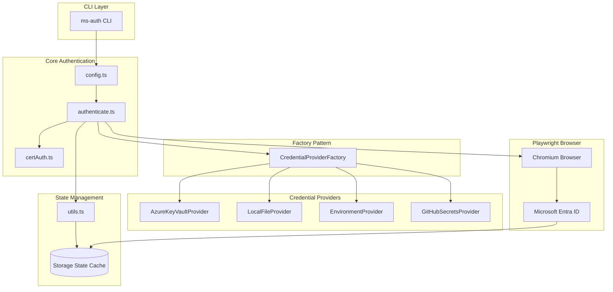
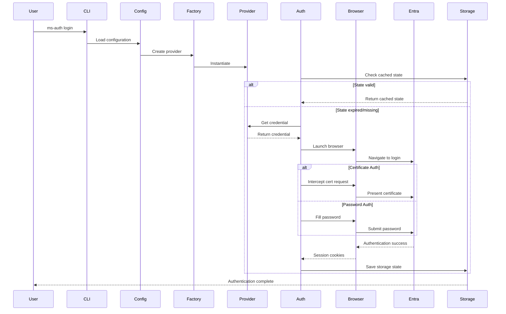
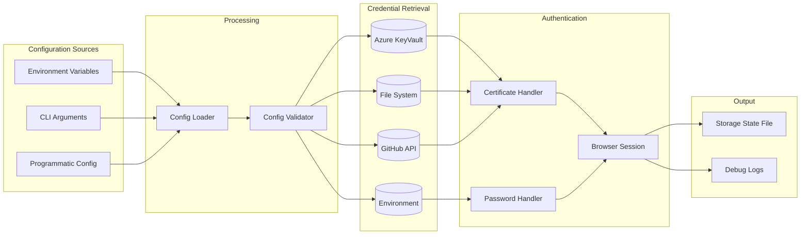
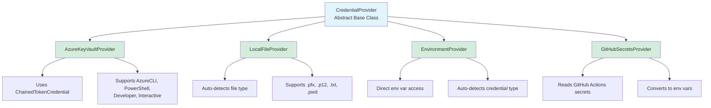

# Playwright Microsoft Authentication

[](https://github.com/deepakkamboj/playwright-ms-auth/actions/workflows/ci.yml)
[](https://www.npmjs.com/package/playwright-ms-auth)
[](https://opensource.org/licenses/MIT)
[](https://nodejs.org/)

[](https://www.typescriptlang.org/)
[](https://playwright.dev/)
[](https://azure.microsoft.com/)

> Enterprise-grade authentication solution for Playwright E2E tests with Microsoft Entra ID (formerly Azure AD)

A robust, production-ready authentication framework that simplifies Microsoft identity integration in Playwright test suites. Built with the Abstract Factory pattern, it supports both password and certificate-based authentication across multiple credential providers including Azure KeyVault, local files, environment variables, and GitHub Secrets.

Perfect for enterprise test automation requiring secure, reusable authentication flows with multi-region support and smart session caching.

## Tech Stack

### Core Dependencies

- **[Playwright](https://playwright.dev/)** (v1.44.1) - Browser automation framework
- **[TypeScript](https://www.typescriptlang.org/)** (v5.4.4) - Type-safe development
- **[Commander.js](https://github.com/tj/commander.js)** (v11.0.0) - CLI framework
- **[@azure/keyvault-secrets](https://www.npmjs.com/package/@azure/keyvault-secrets)** (v4.8.0) - Azure KeyVault integration
- **[@azure/identity](https://www.npmjs.com/package/@azure/identity)** (v4.2.1) - Azure authentication

### Runtime Requirements

- **Node.js** ≥18
- **Playwright Chromium** browser

### Build & Development

- **TypeScript Compiler** - ES2020 target, ESM modules
- **Rimraf** - Cross-platform file cleanup

## Features

- 🔐 **Multiple Authentication Methods**: Password and certificate-based authentication
- 🏭 **Abstract Factory Pattern**: Easily extensible credential provider system
- ☁️ **Multiple Providers**: Azure KeyVault, Local File, Environment Variables, GitHub Secrets
- 🌍 **Multi-Region Support**: Works with different Microsoft Entra endpoints
- 🔧 **CLI Tool**: Full-featured command-line interface
- 🌳 **Environment Variables**: Complete configuration via environment variables
- 💾 **Smart Caching**: Automatic storage state management with expiration
- 📝 **TypeScript**: Full type safety and IntelliSense support
- 🐛 **Debug Logging**: Comprehensive logging for troubleshooting

## Installation

```bash
npm install playwright-ms-auth
```

## Quick Start

### Using CLI

```bash
# Authenticate with Azure KeyVault
npx ms-auth login \
  --url https://your-app.com \
  --email user@company.com \
  --credential-provider azure-keyvault \
  --keyvault-endpoint https://your-vault.vault.azure.net \
  --keyvault-secret your-secret-name \
  --debug

# Authenticate with local certificate file
npx ms-auth login \
  --url https://your-app.com \
  --email user@company.com \
  --credential-type certificate \
  --credential-provider local-file \
  --local-file ./cert.pfx
```

### Using Programmatically

```typescript
import { authenticate, loadConfigFromEnv } from "playwright-ms-auth";

// Load configuration from environment variables
const config = loadConfigFromEnv();

// Perform authentication
await authenticate(config, "https://your-app.com");
```

### In Playwright Tests

```typescript
import { test as base } from "@playwright/test";
import { loadStorageState, type MsAuthConfig } from "playwright-ms-auth";

const config: MsAuthConfig = {
  email: "user@company.com",
  credentialType: "certificate",
  credentialProvider: "azure-keyvault",
  providerConfig: {
    keyVaultEndpoint: "https://your-vault.vault.azure.net",
    secretName: "your-cert-secret",
  },
};

const test = base.extend({
  context: async ({ browser }, use) => {
    const storagePath = await loadStorageState(config);
    const context = await browser.newContext({ storageState: storagePath });
    await use(context);
    await context.close();
  },
});

test("authenticated test", async ({ page }) => {
  await page.goto("https://your-app.com");
  // You're already authenticated!
});
```

## Credential Providers

### Azure KeyVault

Store credentials securely in Azure KeyVault.

```typescript
const config: MsAuthConfig = {
  email: "user@company.com",
  credentialType: "certificate", // or 'password'
  credentialProvider: "azure-keyvault",
  providerConfig: {
    keyVaultEndpoint: "https://your-vault.vault.azure.net",
    secretName: "your-secret-name",
    secretVersion: "latest", // optional
  },
};
```

**Environment Variables:**

- `MS_AUTH_KEYVAULT_ENDPOINT`
- `MS_AUTH_KEYVAULT_SECRET_NAME`

### Local File

Read credentials from local file system.

```typescript
const config: MsAuthConfig = {
  email: "user@company.com",
  credentialType: "certificate",
  credentialProvider: "local-file",
  providerConfig: {
    filePath: "./path/to/cert.pfx",
    certificatePassword: "optional-password", // for encrypted certificates
  },
};
```

**Environment Variables:**

- `MS_AUTH_LOCAL_FILE_PATH`
- `MS_AUTH_CERTIFICATE_PASSWORD`

### Environment Variables

Read credentials directly from environment variables.

```typescript
const config: MsAuthConfig = {
  email: "user@company.com",
  credentialType: "password",
  credentialProvider: "environment",
  providerConfig: {
    variableName: "MY_PASSWORD_VAR",
  },
};
```

**Environment Variables:**

- `MS_AUTH_ENV_VARIABLE_NAME`

### GitHub Secrets

Use GitHub Actions secrets (reads from environment).

```typescript
const config: MsAuthConfig = {
  email: "user@company.com",
  credentialType: "certificate",
  credentialProvider: "github-secrets",
  providerConfig: {
    repository: "owner/repo",
    secretName: "MY_CERT_SECRET",
  },
};
```

**Environment Variables:**

- `MS_AUTH_GITHUB_REPOSITORY`
- `MS_AUTH_GITHUB_SECRET_NAME`
- `MS_AUTH_GITHUB_TOKEN` (optional)

## Environment Variables

All configuration can be provided via environment variables. Run `npx ms-auth env-help` for complete list.

### Core Configuration

- `MS_AUTH_EMAIL` - User email address
- `MS_AUTH_CREDENTIAL_TYPE` - `password` or `certificate`
- `MS_AUTH_CREDENTIAL_PROVIDER` - Provider type
- `MS_AUTH_OUTPUT_DIR` - Directory for storage state files
- `MS_AUTH_LOGIN_ENDPOINT` - Entra endpoint (default: `login.microsoftonline.com`)
- `MS_AUTH_STORAGE_STATE_EXPIRATION` - Hours until state expires (default: 24)
- `SYSTEM_DEBUG` - Enable debug logging (`true`/`false`)

## Architecture

### High-Level Architecture



### Authentication Flow



### Factory Pattern Implementation


### Data Flow Diagram



### Provider Hierarchy



### Code Structure

```
playwright-ms-auth/
├── src/
│   ├── types.ts              # Type definitions & interfaces
│   ├── config.ts             # Environment variable loader
│   ├── authenticate.ts       # Main authentication orchestration
│   ├── certAuth.ts           # Certificate auth route handler
│   ├── utils.ts              # Logging & storage utilities
│   ├── cli.ts                # Command-line interface
│   ├── index.ts              # Public API exports
│   └── providers/
│       ├── CredentialProvider.ts          # Abstract base class
│       ├── AzureKeyVaultProvider.ts       # KeyVault implementation
│       ├── LocalFileProvider.ts           # File system implementation
│       ├── EnvironmentProvider.ts         # Environment var implementation
│       ├── GitHubSecretsProvider.ts       # GitHub secrets implementation
│       ├── CredentialProviderFactory.ts   # Factory pattern
│       └── index.ts                       # Provider exports
├── bin/
│   └── ms-auth               # CLI executable
├── package.json
├── tsconfig.json
└── README.md
```

## Abstract Factory Pattern

The package uses the **Abstract Factory Pattern** for extensibility:

```
CredentialProvider (abstract)
├── AzureKeyVaultProvider
├── LocalFileProvider
├── EnvironmentProvider
└── GitHubSecretsProvider

CredentialProviderFactory
└── createProvider(type, config)
```

### Adding Custom Providers

```typescript
import { CredentialProvider, type CredentialResult } from "playwright-ms-auth";

class MyCustomProvider extends CredentialProvider {
  getProviderName(): string {
    return "My Custom Provider";
  }

  validateConfig(): void {
    // Validate your config
  }

  async getCredential(): Promise<CredentialResult> {
    // Retrieve credential from your source
    return {
      type: "password",
      value: "my-password",
    };
  }
}
```

## License

MIT
